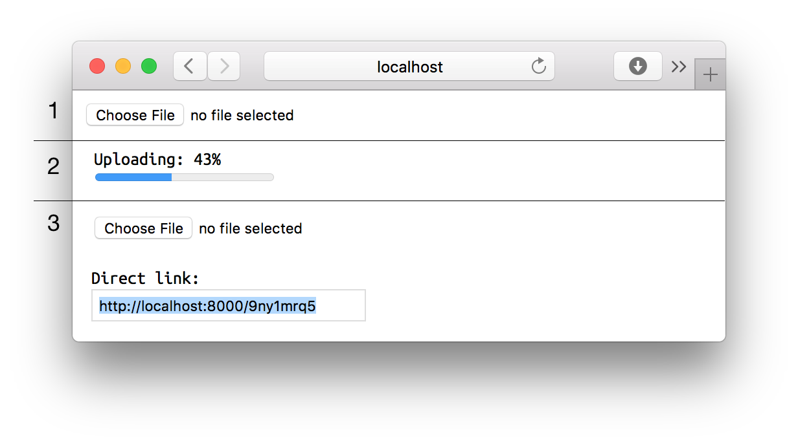

# Storagl

Simple storage for screenshots and other shared files with short direct links.



## Start

```bash
docker run -d -p 8000:8000 -v $(pwd)/data:/data -e ALLOWED_HOST=localhost zenwalker/storagl
```

## Cleanup

Remove files which not downloads for last year.

```bash
docker run --rm -it -v $(pwd)/data:/data zenwalker/storagl cleanup --days=365
```
